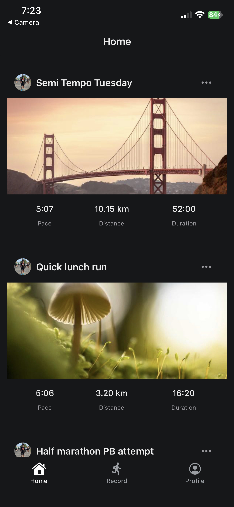
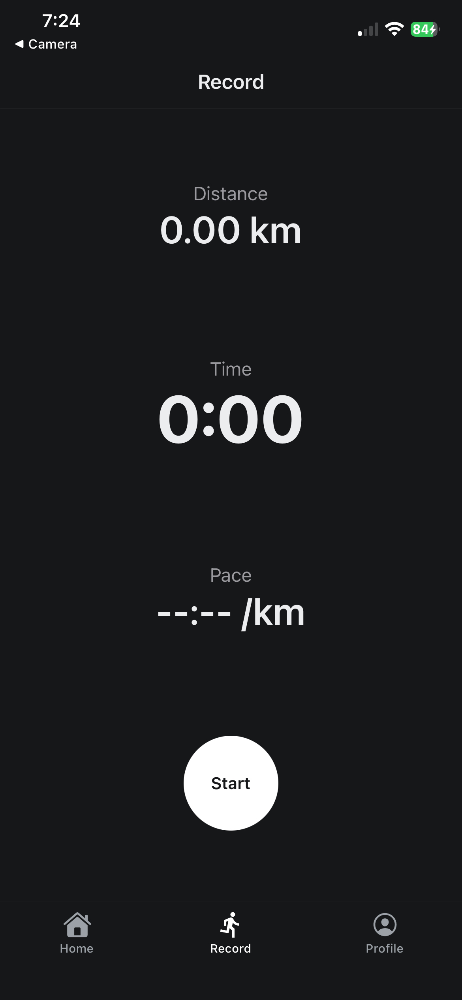
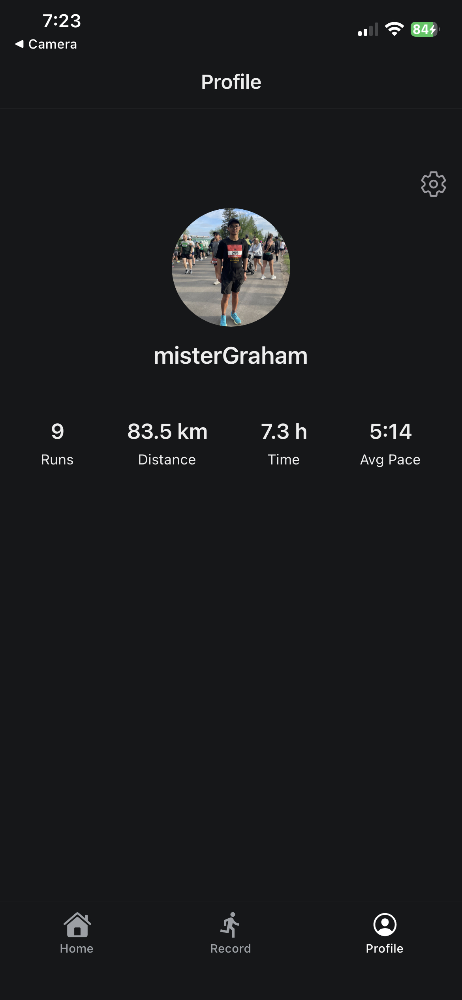

# RunTracker

A full-stack mobile running tracker built with React Native (Expo) and Supabase — GPS-based run recording, live pace tracking, and a photo-enabled activity feed.

## Screenshots

| Home Feed                        | Recording                            | Profile                                |
| -------------------------------- | ------------------------------------ | -------------------------------------- |
|  |  |  |

## Features

- Email/password authentication via Supabase Auth
- Live GPS run tracking — distance, duration, and rolling pace calculation
- Pause/continue/discard/save flow for recording a run
- Photo uploads for runs and profile avatars via Supabase Storage
- Edit run title and photo after saving
- Delete runs
- Aggregate stats on Profile (total distance, total time, average pace)
- Light/dark theme support, following system settings
- Row Level Security ensuring users can only access their own data

## Tech Stack

- **Frontend:** React Native, Expo, Expo Router
- **Backend:** Supabase (Postgres, Auth, Storage, Row Level Security)
- **Location:** expo-location for GPS tracking

## What's Mocked / Not Yet Implemented

- Background GPS tracking (currently foreground-only)
- Route map display
- Social features (following other users, public feeds)

## Getting Started

\`\`\`bash
npm install
npx expo start
\`\`\`
Requires a Supabase project — see `.env.example` for required environment variables.

## Database Schema

Brief description or link to your `runs`/`profiles` table structure, RLS policies, etc.
