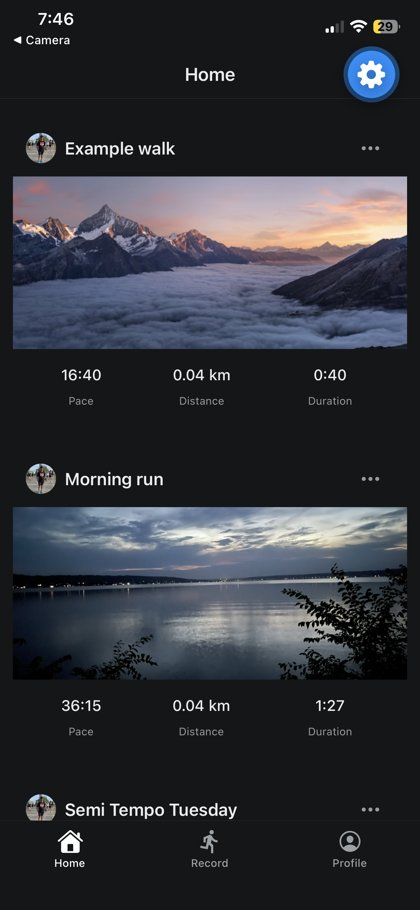

# RunTracker

This app is made for the sole purpose of promoting fitness and additional motivation.
It helps log your runs, record when you don't have a watch and nerd out the stats if you want.

## Screenshots

<!-- table or row of images, e.g.  -->

## Features

<!-- bullet list of what it actually does -->

## Tech Stack

<!-- Frontend / Backend / Location / Maps, etc. -->

## What's Mocked / Not Yet Implemented

<!-- honest scoping — background GPS, route encoding, social features, etc. -->

## Getting Started

<!-- install + run commands, env vars needed -->

## Database Schema

<!-- brief description of runs/profiles tables, RLS approach -->

## Lessons Learned / Notable Decisions

<!-- optional but strong for a portfolio piece — e.g. why haversine over a maps API for distance, the dirty-flag refetch approach, foreground-only GPS tradeoff -->
